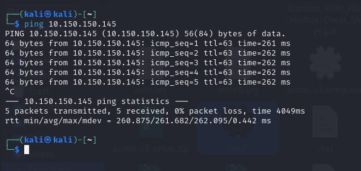
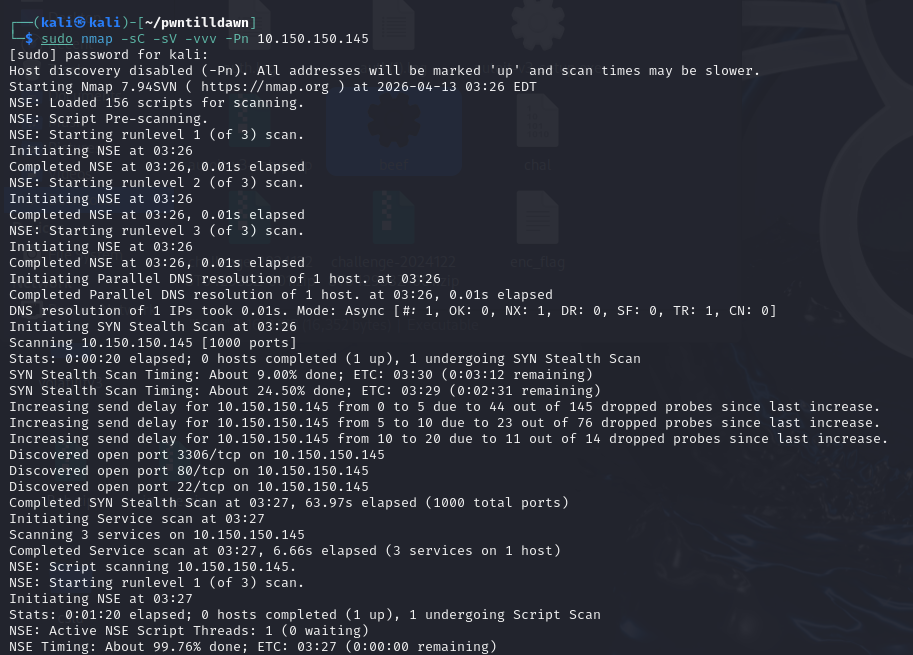
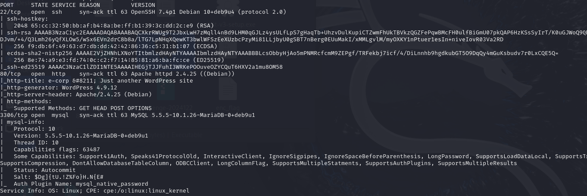
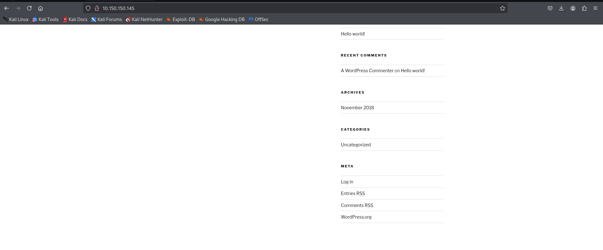

## Write up for Machine 10.150.150.145

```bash
ping 10.150.150.145
```
First we need to ping the machine 10.150.150.145 to see if the host is up.



So, we can see the host is up! Now we can start our first step which is information gathering.

```bash
sudo nmap -sC -sV -vvv -Pn 10.150.150.145
```
## Nmap Command Breakdown

| Option | Meaning | Description |
|--------|---------|-------------|
| `sudo` | Superuser privileges | Required for certain scan types; gives full network access |
| `-sC` | Default script scan | Runs Nmap's standard set of built-in scripts for service enumeration |
| `-sV` | Version detection | Probes open ports to identify service/application versions |
| `-vvv` | Very verbose output (level 3) | Shows maximum detail about scan progress and findings |
| `-Pn` | No ping | Treats target as online without ICMP ping probes (bypasses ping sweeps) |
| `10.150.150.145` | Target IP | The specific host to scan |




## Scan Summary

| Port | State | Service | Version |
|------|-------|---------|---------|
| **22/tcp** | OPEN | SSH | OpenSSH 7.4p1 Debian 10+deb9u4 |
| **80/tcp** | OPEN | HTTP | Apache httpd 2.4.25 (Debian) |
| **3306/tcp** | OPEN | MySQL | MariaDB 10.1.26 |

The target system has **three exposed services** with the most critical being the **publicly accessible MariaDB database** on port 3306. The outdated WordPress installation presents a high-risk web attack surface, while SSH provides a medium-risk entry point.

From our initial scan, we can see that port 80 (HTTP) is open. Let's begin our web enumeration by browsing to the target in a browser.
```bash
http://10.150.150.145
```



Now, we need to use our bug bounty mindset by exploring all the functions in the web. And we can see login page which is we can try to do injection attacks if the input box is not validated.


