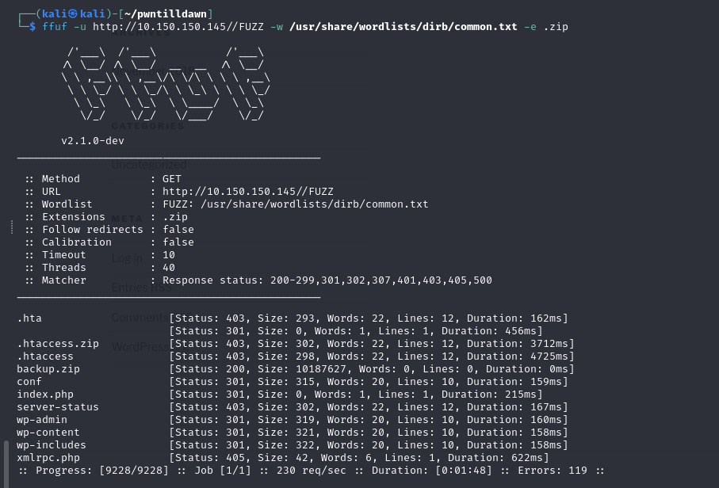
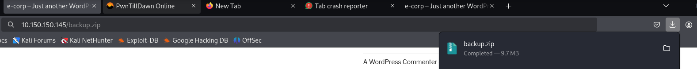
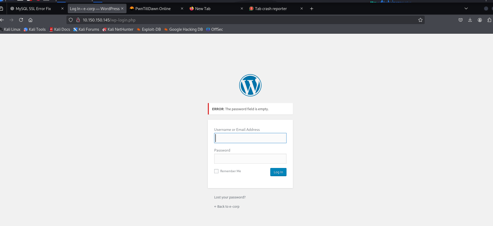
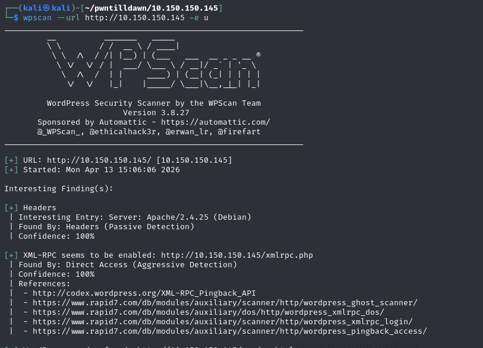
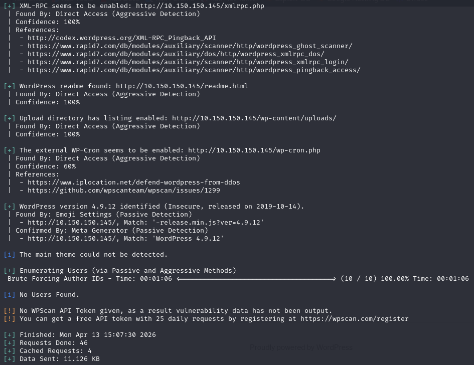
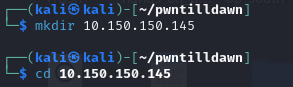
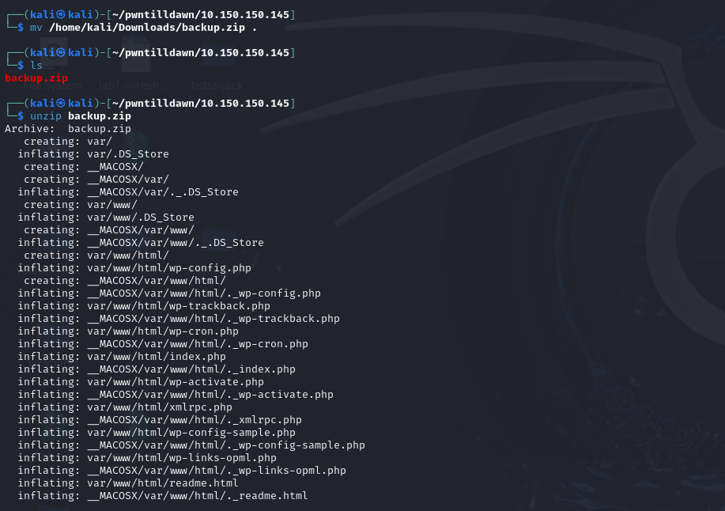
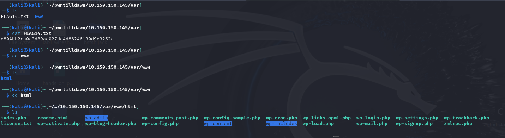

## Write up for Machine 10.150.150.145

```bash
ping 10.150.150.145
```
First we need to ping the machine 10.150.150.145 to see if the host is up.


So, we can see the host is up! Now we can start our first step which is information gathering.

```bash
sudo nmap -sC -sV -vvv -Pn 10.150.150.145
```
## Nmap Command Breakdown

| Option | Meaning | Description |
|--------|---------|-------------|
| `sudo` | Superuser privileges | Required for certain scan types; gives full network access |
| `-sC` | Default script scan | Runs Nmap's standard set of built-in scripts for service enumeration |
| `-sV` | Version detection | Probes open ports to identify service/application versions |
| `-vvv` | Very verbose output (level 3) | Shows maximum detail about scan progress and findings |
| `-Pn` | No ping | Treats target as online without ICMP ping probes (bypasses ping sweeps) |
| `10.150.150.145` | Target IP | The specific host to scan |


## Scan Summary

| Port | State | Service | Version |
|------|-------|---------|---------|
| **22/tcp** | OPEN | SSH | OpenSSH 7.4p1 Debian 10+deb9u4 |
| **80/tcp** | OPEN | HTTP | Apache httpd 2.4.25 (Debian) |
| **3306/tcp** | OPEN | MySQL | MariaDB 10.1.26 |

The target system has **three exposed services** with the most critical being the **publicly accessible MariaDB database** on port 3306. The outdated WordPress installation presents a high-risk web attack surface, while SSH provides a medium-risk entry point.

From our initial scan, we can see that port 80 (HTTP) is open. Let's begin our web enumeration by browsing to the target in a browser.
```bash
http://10.150.150.145
```


Furthermore, we can use the FFUF tool to perform directory and file brute-forcing against the web server. 
FFUF allows us to discover hidden directories, backup files, administrative interfaces, and other sensitive resources that may not be linked from the main site.
```bash
ffuf -u http://10.150.150.145//FUZZ -w /usr/share/wordlists/dirb/common.txt -e .zip,.html,.txt,.php    
```



By providing a wordlist of common directory and file names, FFUF sends requests to each potential path and analyzes the HTTP response codes (e.g., 200 OK, 403 Forbidden, 301 Redirect) to identify existing content.
In this case we can see that the /backup.zip has status:200 and the file size is big  which indicates may containing something in it.


we put in the url /backup.zip to access the zip, and we are able to download the zip file. We will further disect this zip file after we finish scanning this website which is built by using wordpress.



It is advisable for us to gather as much as information before we starting our exploitation.
So, as we can see this wordpress is vulnerable and we can use wpscan to scan the target.
```bash
wpscan --url http://10.150.150.145 -e u
```
## wpscan Command: `wpscan --url http://10.150.150.145 -e u`

| Flag | Full Option | Purpose |
|------|-------------|---------|
| `wpscan` | - | WordPress security scanner |
| `--url` | `--url` | Target URL specification |
| `http://10.150.150.145` | - | Target IP address (port 80) |
| `-e` | `--enumerate` | Enable enumeration mode |
| `u` | `usernames` | Discover WordPress usernames |




The wpscan enumeration revealed multiple critical security issues on the WordPress target. The site is running WordPress version 4.9.12, released in October 2019, which is severely outdated and vulnerable to numerous known exploits. 
XML-RPC is enabled at /xmlrpc.php, creating vectors for brute-force attacks and DDoS amplification. Most critically, directory listing is enabled on the uploads directory at /wp-content/uploads/, allowing anyone to browse uploaded files—potentially including malicious shells or sensitive documents. 
While the scan attempted to enumerate users via author ID brute force (IDs 1-10), no usernames were discovered, suggesting either a fresh installation or a security plugin hiding user data.

## Exploitation
Now we can unzip the backup.zip file by using
```bash
unzip backup.zip
```






